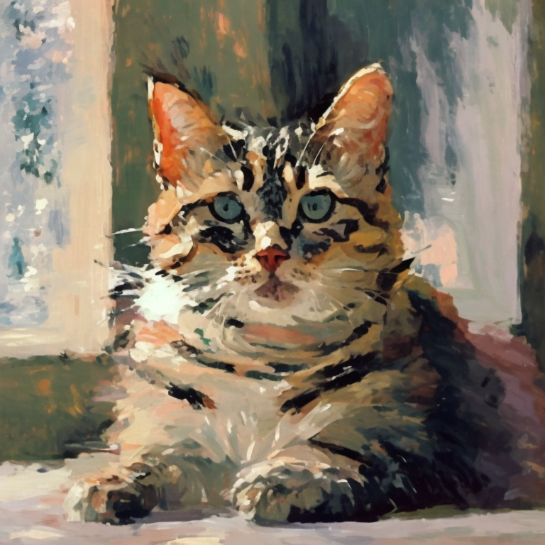
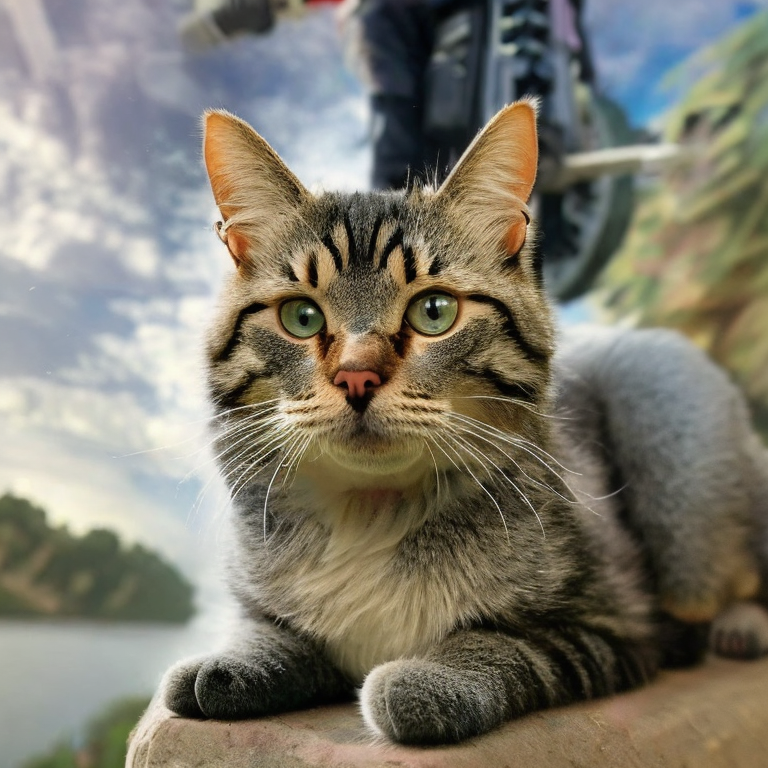

# 基于stable diffusion的图像编辑

## iamge demo

<table style="width: 100%;">
        <tr>
            <td style="width: 50%;">
                
                
reference image

            </td>
            <td style="width: 50%;">
                
                
 cute style 

            </td>
        </tr>
</table>

<table style="width: 100%;">
        <tr>
            <td style="width: 50%;">
                
                
 Fauvism style 

            </td>
            <td style="width: 50%;">
                
                
 Gta5 style 

            </td>
        </tr>
</table>
## Video demo
<table style="width: 100%;">
        <tr>
            <td style="width: 50%;">
                
                
before:a tea pot pouring tea into a cup

            </td>
            <td style="width: 50%;">
                
                
after:vector illustration of a tea pot pouring tea into a cup.

            </td>
        </tr>
    </table>

<table style="width: 100%;">
        <tr>
            <td style="width: 50%;">
                
                
before:a tea pot pouring tea into a cup

            </td>
            <td style="width: 50%;">
                
                
after:rainbow-colored origami flamingos standing in the water near a tree,
      best quality.

            </td>
        </tr>
    </table>

## 图像编辑

### inversion

### masactrl

## 视频编辑

### VidTome

### FateZero
